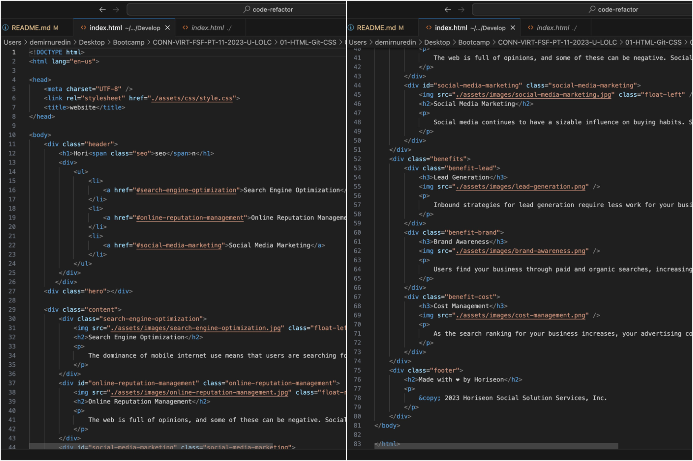
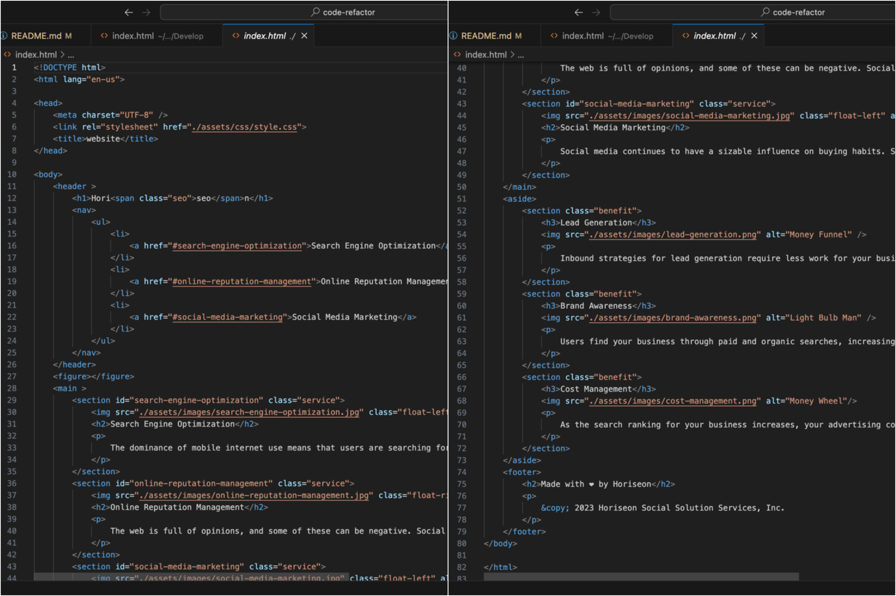
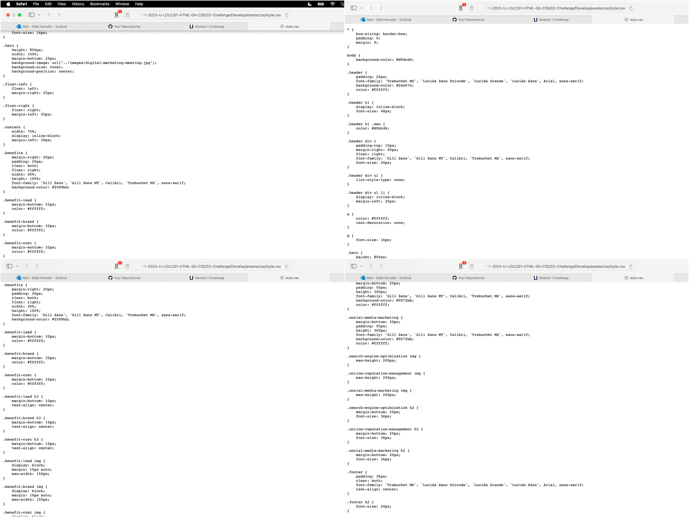
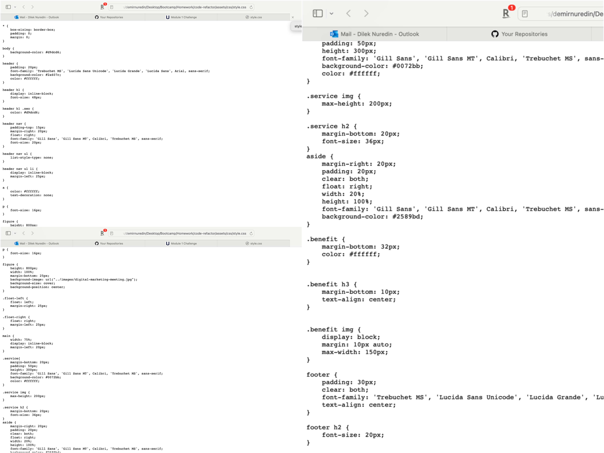

# Code Refactor
From non-semantic to accessible! 
## Description

This project's purpose was to refactor a web page so taht HTML elements are consolidated and semantic, and DRY code principle is reflected in CSS.
And to optimize the code for search engines.

## Code Highlights

In order to form an accessible web page I changed the non-semantic HTML elements with the semantic HTML elements. 
In CSS I used thr DRY principle to reduce and maintain the code.  
I will add some screenshots below so you can see the difference between. 

## Deployment Link

[Horiseon](https://dileknrdn.github.io/code-refactor/)

## Author
by: Dilek Nuredin
